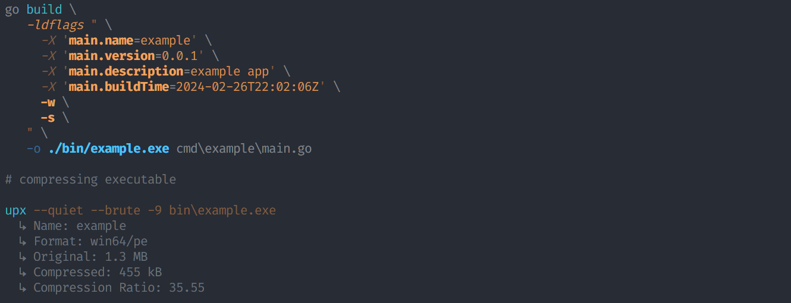
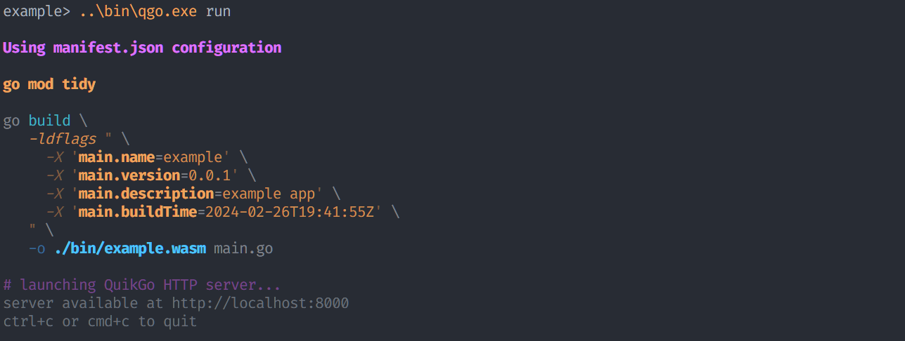
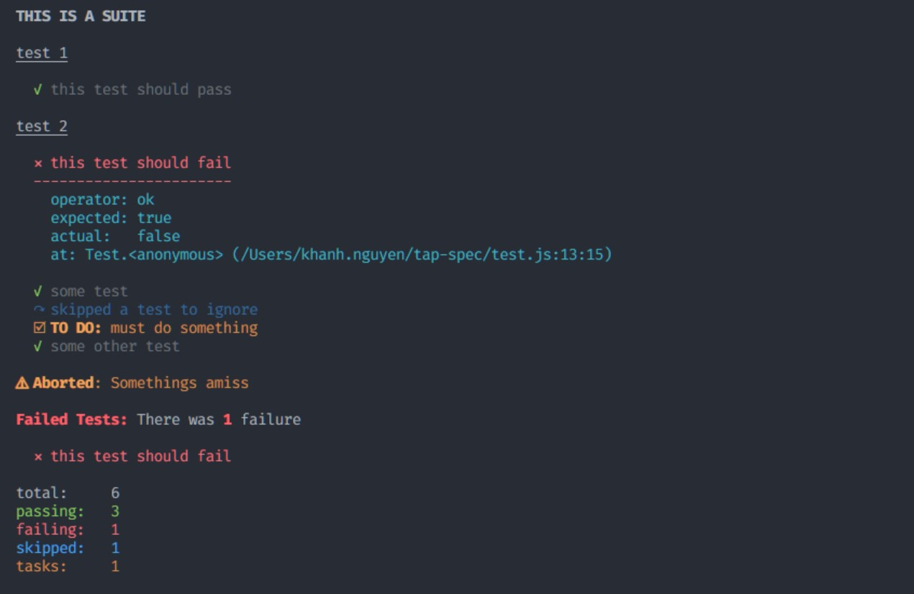
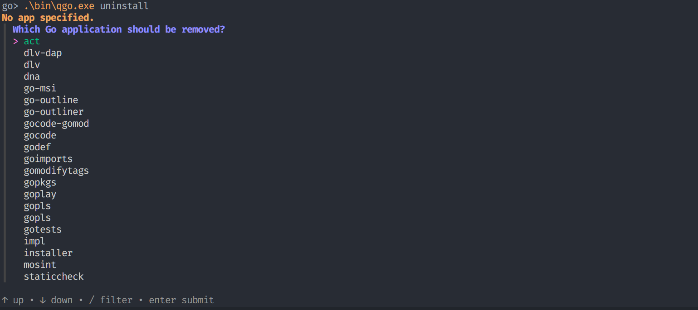

# QuikGo (qgo)

QuikGo expands upon the Go toolchain, providing a simple and consistent developer experience across projects.

QuikGo adds:

- [`manifest.json` files](#automation). Commands like `build` and `run` provide more complex configurations (ex: automatic `go mod tidy`, ldflags/variable substitution, minification, etc) without a complex command.
- New project initialization with working code (modules/packages, apps/commands, WASM).
- Integrated support for UPX, TinyGo, and other utilities.
- Live reload support for applications.

Developers only need to remember a few basic commands:

| Basic Command                | Description                                                  |
| ---------------------------- | :----------------------------------------------------------- |
| [`qgo init`](#init)           | Initialize a new app (with templates).                       |
| [`qgo run`](#run--build)      | Like `go run`, but reads configuration from JSON.          |
| [`qgo build`](#run--build)    | Like `go build` but reads configuration from JSON.         |
| [`qgo test`](#test)           | Run the test suite with TAP/formatted output (pretty tests). |
| [`qgo bump`](#init)           | Bump the version number.
| [`qgo todo`](#todo)           | Output all the TODO items in the code base.                  |
| [`qgo exec`](#exec)           | Run local scripts found in the manifest.                     |
| [`qgo uninstall`](#uninstall) | Uninstall apps that were installed with `go install`.      |

By simplifying the development environment, Go developers derive the following benefits:

- Automation
- Standards & Architecture
- Lower Mental Overhead

**INSTALLATION**

```sh
go install github.com/quikdev/go/cmd/qgo@latest
```

_Alternatively, download the latest binary release and add it to your `PATH`._

### Automation

`qgo` auto-constructs/runs commands using parameters found in a `manifest.json` file. This file exists in the same directory as your `go.mod` and `main.go`/`mymodule.go` files.

For example, consider the following `manifest.json` file:

```js
{
  "name": "demo",                               // Ouput name
  "version": "1.0.0",                           // Version number
  "description": "A simple test app.",          // Description
  "build": "main.go",                           // The source file to build

  "variables": {                                // Build-time variables provided to the app
    "main.name": "manifest.name",               // Dynamic reference to manifest.name above
    "main.version": "manifest.version",         // Dynamic reference to the manifest.version above
    "main.description": "manifest.description", // Dynamic reference to the manifest.description above
    "main.author": "env.USER"                   // Dynamic reference to the USER environment variable
  },

  "minify": true,                               // Applies common build techniques to reduce binary size

  "tags": [                                     // Tags to pass to the build process
    "a-tag",
    "b-tag"
  ],
  "verbose": true,                              // Verbose output (list modules)
  "cwd": "/path/to/root"                        // The current working directory of the app
}
```

Executing `qgo run` will generate and run the following command:

```go
go build \
   -C .\path\to\root \
   -v \
   -ldflags " \
     -X 'main.name=demo' \
     -X 'main.version=1.0.0' \
     -X 'main.description=A simple test app.' \
     -X 'main.author=my_username' \
     -X 'buildTime=2023-10-05T23:35:27Z' \
     -c \
     -w \
     -s \
   " \
   -tags " \
      a-tag, \
      b-tag \
   " \
   -o .\bin\demo.exe \
   main.go \
&& .\bin\demo.exe
```

This command will build an executable called `demo` (specified in the JSON `name` attribute) from the `main.go` source file (specified in the JSON `build` attribute). If the `build` attribute is not defined in the JSON, qgo attempts to find the file with the `main()` function.

This example assumes several build variables exist in the main module (`description`, `name`, `version`, `buildTime`). The `buildTime` variable is always applied by `qgo` even though it is not in the `manifest.json` file. If your app does not use it, it is ignored. This command results in the execution of a binary built as though it were ready for distribution, simply by calling `qgo run`. Notice that some of the variable values in the `manifest.json` are `manifest.<attribute>`. These specify dynamically generated values found elsewhere in the manifest. It is also possible to specify `env.<variable>` values, which will derive the attribute value from a local environment variable.

By leveraging a `manifest.json` file, these parameters can be committed alongside Go source code, allowing a portable/standard experience for building/running Go apps.

### Use Cases

#### Antivirus

Consider the standard `go run myapp.go` command. This produces a temporary executable with a unique filename before running the temporary executable. Windows Defender and other antivirus suites can block these temporary files, throwing `Access denied.` errors (often sporadically). Exceptions can be made to allow-list executables in these tools, but they expect the executable to have a consistent name. As a result, it is easier to run `go build myapp.go && myapp.exe` so `myapp.exe` can be allow-listed with the antivirus suite. This is not intuitive or easy to remember when you're used to just running `go run myapp.go`. Plus, it's annoying to take time specifically to allow-list a particular executable. Most developers bypass this by allowing all executables, which defeats the purpose of these protections.

QuikGo automates this process, guaranteeing the same file name is used for each build while maintaining the simplicity of `go run`.

**_For Windows Users_**

Typically, Windows will grant access after denying if the same file is explicitly run a few times. There are scenarios where you may need to exclude it from Windows Defender though.

To do this, navigate to `%ProgramFiles%\Windows Defender`, then run the following as Administrator:

```powershell
MpCmdRun.exe -AddDynamicSignature -Path C:\path\to\my.exe
```

Alternatively, use the GUI:

1. Open Windows Security.
2. Go to Virus & threat protection.
3. Under Exclusions, select Add or remove exclusions.
4. Select Add an exclusion, and choose the file you want to exclude.

#### Versioning

Consider `go build -ldflags "-X 'main.version=1.0.0'" myapp.go && myapp.exe`. Dynamically specifying a version number (as opposed to hard-coding) is a common development need, which is easily solved using ldflags. This isn't something you want to type over and over though. Automating this delegates the versioning logic to the manifest file, so you only need to run `qgo build` instead of this big command.

# Commands

## Init

The `init` command provides a simple wizard to setup a new Go project. It will generate the appropriate `go.mod`, `go.work`, `manifest.json`, `README.md`, a license file, and starter code with unit tests. The wizard provides options to generate projects with the [recommended code layouts](https://go.dev/doc/modules/layout#package-or-command-with-supporting-packages) laid out by the Go team. It can also configure your git repo (optional).

```sh
Usage: qgo init

Setup a new Go module or application

Flags:
  -h, --help         Show context-sensitive help.
  -v, --version      Display the QuikGo version.
  -o, --overwrite    If a project already exist, overwrite with no backup
                     and no prompt.
```

## Run & Build

The build & run commands are the same. They both build the executable. Run attempts to run the program after the build completes. Run also supports native live-reloading for applications.

```sh
Usage: qgo build [<file>]

Build the Go application

Arguments:
  [<file>]        Go source file (ex: main.go)
  [<args> ...]    Arguments to pass to the executable.

Flags:
  -h, --help                 Show context-sensitive help.
  -v, --version              Display the QuikGo version.
  -b, --bundle=BUNDLE,...    Bundle the application into a tarball/zipball
      --os=OS,...            The operating system(s) to build for (any options
                             from 'go tool dist list' is valid)
      --wasm                 Output a web assembly (OS is ignored when this
                             option is true)
  -o, --output=STRING        Output file name
  -t, --tips                 Display tips in the generated commands
  -m, --minify               Set ldflags to strip debugging symbols and remove
                             DWARF generations
  -s, --shrink               Set gccgoflags to strip debugging symbols and
                             remove DWARF generations
  -c, --compress             Compress with UPX
      --tiny                 Use tinygo (if available) instead of go to build.
  -d, --dry-run              Display the command without executing it.
      --nowork               Set GOWORK=off when building
      --no-cache             Ignore the cache and rebuild, even if no Go files have changed.
  -u, --update               Update (go mod tidy) before building.
```

Both qgo commands output the `go` command being run, providing full transparency into what is happening on your computer. This command can be copied/pasted to run it directly. For example:

```go
Using manifest.json configuration

go build \
   -C .\path\to\root \
   -v \
   -ldflags " \
     -X 'main.name=demo' \
     -X 'main.version=1.0.0' \
     -X 'main.description=A simple test app.' \
     -X 'main.buildTime=2023-10-05T23:35:27Z' \
   " \
   -tags " \
      a-tag, \
      b-tag \
   " \
   -o .\bin\demo.exe \
   main.go \
&& .\bin\demo.exe // this line only exists for `qgo run`
```

An optional `-t` flag adds tooltips to the output command. For example:

```go
go build \
   -v (print package names as they are compiled) \
   -ldflags (link arguments to go tool) " \
     -X 'main.name=Demo' \
     -X 'main.version=1.0.0' \
     -X 'main.description=A simple test app.' \
     -X 'main.buildTime=2024-02-17T05:17:32Z' \
   " \
   -o(utput) "./\bin\test.exe" \
   app.go (input file)
```

An optional `-d` flag (dry-run) outputs the command without running it.

For other flags, use `--help`.

### Live Reload

The live reload feature monitors `./*.go` and `./**/*.go` by default.

> Two patterns are used instead of `**/*.go` because Go's `filepath.Glob` capabilities do not recognize this pattern properly.

The project will attempt to rebuild and re-run itself when a file is created, changed, or removed. In the WASM test environment, the browser will automatically refresh when the new `.wasm` is available.

This can be disabled by setting `"livereload": []` in the package/manifest, or it can be customized with the desired paths using [glob patterns](https://en.wikipedia.org/wiki/Glob_(programming)).

### Compressing with UPX

The `--compress` or `-c` flags can be passed to the build command to use [upx](https://upx.github.io/) (if installed) to reduce the file size of executables. Alternatively, configure `"compress": true` or `"upx": true` in the `manifest.json` file. The following screenshot was taken using `"compress": true` in the project's `manifest.json` file.



### Building Web Assemblies (WASM)

Web assembly generation is a little different from common Go applications. The `compress` method, which uses [upx](https://upx.github.io/), and some other minification features cannot be applied to web assemblies. These are automatically ignored.

By default, the standard Go toolchain is used to compile WASM files. The templates generated by the `init` method support Go's WASM build capabilities. Go currently generates fairly large WASM files, with the smallest being ~2MB (average ~10MB). The Go team indicates work is being performed to reduce these file sizes, but there is no estimate when this work will be complete.

For users who are sensitive to the file size, [tinygo](https://tinygo.org/) offers an option that can dramatically reduce file sizes (~10kb). The code syntax is unique to tinygo. QuikGo does _not_ generate tinygo templates, but QuikGo does support using tinygo to build web assemblies. In other words, it's up to you to install tinygo and figure out the code, but QuikGo can still build it for you. Please note that at this time, QuikGo only adds `-target=wasm` (not wasi). We'd be open to a PR adding functionality to specify the wasi/wasm output format.

There are two ways to use `tinygo`. First, supply the `--tiny` flag to the build process, i.e. `qgo build --tiny`. The other option is to add `"tiny": true` to the `mainfest.json`, then run `qo build`.

### Running Web Assemblies (WASM)

Unlike Go, web assemblies can be run in different environments, such as Node.js, Deno, Bun, and browsers. Since most WASM targets the browser, QuikGo attempts to make it simple to run a WASM in the browser. Running `qgo run` on a web assembly project will build and launch a standalone static HTTP test server using the project's `bin` directory as the source. It will automatically open your browser to the appropriate URL.




## Test

```sh
Usage: qgo test

Run unit tests

Flags:
  -h, --help             Show context-sensitive help.
  -v, --version          Display the QuikGo version.
  -f, --format="spec"    The format to diplay test results in. Defaults to
                         'spec', a TAP visualizer. Options include 'tap',
                         'spec', 'json', and 'go' (i.e. go test standard)
```

The test command will run the test suite(s) the same way `go test` would, with a few differences. By default, test results will be converted to [TAP](https://testanything.org) format and output with pretty-printing (spec format).

> _The screen captures were taken from a JavaScript project formatted with [tapfmt](https://github.com/coreybutler/tapfmt), which is the underlying TAP formatting engine used in qgo._



Pretty-printing can be disabled if you prefer to use an alternative TAP renderer. The raw format would be available as:

```
TAP version 14
# THIS IS A SUITE
# test 1
ok 1 this test should pass
Bail out! Somethings amiss
# test 2
not ok 2 this test should fail
  ---
    operator: ok
    expected: true
    actual:   false
    at: Test.<anonymous> (/Users/khanh.nguyen/tap-spec/test.js:13:15)
  ...
ok 3 some test
not ok 4 # skip a test to ignore
ok 5 # todo must do something
ok 6 some other test
1..6
```

It is also possible to ignore the TAP conversion to leverage the standard go output format (`qgo test -f go`), or to specify JSON (`qgo test -f json`).

These settings can be configured in the `manifest.json` files under the `test` attribute:

```js
{
  "test": {
    "format": "none|tap|tap13|spec|json", // spec is the pretty output/default
    "debug": true|false                   // run tests with debugging turned on
  }
}
```

## Bump

Bump the version number in the `manifest.json` file.

```sh
Usage: QuikGo bump [<type>]

Bump the semantic version number in the manifest

Arguments:
  [<type>]    major, minor, patch (default), prerelease, or build

Flags:
  -h, --help       Show context-sensitive help.
  -v, --version    Display the QuikGo version.
```

For example, if manifest.json has a `"version": "1.0.0"`, running `qgo bump` will update the value to `"version": "1.0.1"`. Running `qgo bump minor` will update the value to `"version": "1.1.0"`. Running `qgo bump major` will update the value to `"version": "2.0.0"`. At this time, `prerelease` and `build` are not supported.

## Todo

The `todo` command is a convenience method that parses all of the `.go` files, identifying comments that start with `// TODO` (or some case insensitive variation). All items are output to the screen. It is also possible to save this to disk.

```sh
Usage: QuikGo todo

List all of the todo items found in the code base.

Flags:
  -h, --help                    Show context-sensitive help.
  -v, --version                 Display the QuikGo version.

  -f, --format="text"           output in a specific format
  -s, --save                    save output to disk
  -o, --output="./todos.txt"    output file name/location
```

Valid formats include `json`, `markdown`/`md`, and `text` (default).

Output looks like:

_JSON_

```js
[
  {
    "Path": "cmd\\main.go",
    "Line": 20,
    "Comment": "Abstract this code to a function"
  },
  {
    "Path": "cmd\\main.go",
    "Line": 23,
    "Comment": "Add notes about why this had to be written"
  },
  {
    "Path": "cmd\\main.go",
    "Line": 34,
    "Comment": "Remove this when v3.0.0 is released"
  }
]
```

_Markdown_

```
[ ] Abstract this code to a function _at cmd\main.go:**20**_
[ ] Add notes about why this had to be written _at cmd\main.go:**23**_
[ ] Remove this when v3.0.0 is released _at cmd\main.go:**34**_
```

_Text_

```
Abstract this code to a function
  at cmd\main.go:20

Add notes about why this had to be written
  at cmd\main.go:23

Remove this when v3.0.0 is released
  at cmd\main.go:34
```

## Exec

```sh
Usage: QuikGo exec <script> [<args> ...]

Run a script from the manifest/package

Arguments:
  <script>        Name of the script to execute
  [<args> ...]    Additional arguments to pass to the script

Flags:
  -h, --help       Show context-sensitive help.
  -v, --version    Display the QuikGo version.
```

The `exec` command runs the script/command found in the manifet/package `script` attribute. For example:

```js
{
  "scripts": {
    "test:go": "qgo test -f go",
    "test:tap": "qgo test -f tap",
    "test:json": "qgo test -f json"
  }
}
```

Running `qgo exec test:json` would execute `qgo test -f json`.

## Uninstall

The `qgo uninstall` command is a convenience utility for "uninstalling" applications that were installed using `go install` (i.e. like QuikGo itself).

Go does not provide a way to do this. To remove an installed app, you need to know whether it is stored in the `GOBIN` or `GOPATH` root, which can vary depending on how Go is setup on a computer.

It's easy to forget where a utility is installed, especially when it is not defined on the system or user `PATH`. Developers often know the name of the app, but forget where it is stored.

QuikGo simplifies this. Run `qgo uninstall [app_name]` to uninstall a specific application. If you do not know the specific name, run `qgo uninstall` to be prompted with a list of all available applications. For example:



The uninstall process is very basic. It finds the file and deletes it (with a warning).

For programmatic use, pass the `--no-warn` flag if you want to skip the warning/prompt. For example, `qgo uninstall --no-warn myapp`.

## Full List of Manifest Options

```js
{
  "a": true,                                // Force rebuilding of packages that are already up-to-date
  "asan": true,                             // Enable interoperation with address sanitizer
  "author": "John Doe",                     // Author
  "bin": "output directory",                // Alias for "output" (i.e. where binaries are generated)
  "build": "main.go",                       // File to build
  "buildmode": "mode",                      // Build mode to use
  "buildvcs": true,                         // Whether to stamp binaries with version control information
  "compress": true,                         // Run UPX on builds
  "compiler": "name",                       // Name of compiler to use
  "cover": true,                            // Enable code coverage instrumentation
  "covermode": "set",                       // Set the mode for coverage analysis
  "cwd": "/path/to/project",                // Current working directory
  "description": "my example app",          // Description
  "env": {                                  // Environment variables
    "variable": "value",                    // Variable/value
    "variable2": "manifest.attr"             // Variable/self-referencing value
  },
  "ldflags": [				    // Additional LDFlags
    "-H windowsgui"			    // example LDFlag
  ],
  "license": "MIT",                         // SPDX ID or Custom
  "livereload": [                           // Monitored paths for live-reload (apps only). Supports glob
    "./*.go",
    "./**/*.go"
    ],syntax.
  "minify": true,                           // Strip debugging symbols from generated executables
  "mod": "mode",                            // Module download mode to use
  "modcacherw": true,                       // Leave newly-created directories in the module cache read-write instead of making them read-only
  "modfile": "file",                        // In module aware mode, read an alternate go.mod file
  "msan": true,                             // Enable interoperation with memory sanitizer
  "n": true,                                // Print the commands but do not run them
  "name": "myapp",                          // Project name
  "no-cache": false,                        // Set to true to forcibly rebuild/ignore the cache.
  "overlay": "file",                        // Read a JSON config file that provides an overlay for build operations
  "output": "output directory",             // Directory where binaries are output
  "p": 1,                                   // The number of programs that can be run in parallel
  "pgo": "file",                            // Specify the file path of a profile for profile-guided optimization
  "port": 8000,                             // Port to run WASM test server on
  "scripts": {                              // Collection of scripts to run with qgo exec
    "alias": "<command>"                    // Alias and command
  },
  "shrink": false,                          // Strip debugging symbols when using GCC
  "tags": ["tag_a", "tag_b"],               // Build tags
  "test": {
    "format": "none|tap|tap13|spec|json",   // spec is the pretty output/default
    "debug": false                          // run tests with debugging turned on
  }
  "tidy": true,                             // Alias for update
  "tiny": false,                            // Use tinygo instead of go
  "toolexec": "cmd args",                   // A program to use to invoke toolchain programs like vet and asm
  "trimpath": true,                         // Remove all file system paths from the resulting executable
  "update": true,                           // Run go mod tidy before build/run
  "upx": true,                              // Alias for compress
  "variables": {                            // LDFlag Variables
    "manifest.variable": "manifest.attribute",// Self referencing value
    "manifest.variable2": "env.VARIABLE",    // Environment variable
    "manifest.variable3": "some value"       // Hard coded value
  },
  "verbose": false,                         // Verbose output
  "wasm": true,                             // Indicates this is a web assembly project
  "work": true,                             // Print the name of the temporary work directory and do not delete it when exiting
  "x": true                                 // Print the commands
}
```

---

Copyright &copy; 2024, [Corey Butler](https://github.com/coreybutler), [Author Software, Inc.](https://github.com/author), and collaborators.
